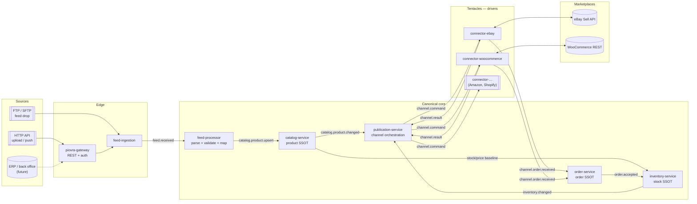

# 01 — Architecture

## 1. Overview



The most important loop is the one at the bottom: **an order on one channel → canonical decrement →
propagation to every channel**.

## 2. Context and actors

| Actor | Interaction |
|---|---|
| Merchant / operator | uploads feeds, inspects sync status, resolves errors from the console |
| External system (ERP, PIM) | publishes feeds over FTP or HTTP |
| Marketplace | receives listings and updates, returns orders |
| Operations | watches metrics, manages the DLQ and replays |

## 3. Service decomposition

Services are cut by **the data they own**, not by the verb they perform:

| Service | Owns |
|---|---|
| `feed-ingestion` | the raw files received and their lifecycle |
| `feed-processor` | the feed → canonical record translation and validation outcomes |
| `catalog-service` | products, variants, attributes, canonical revision |
| `inventory-service` | canonical stock and the movement ledger |
| `order-service` | normalized orders and their state |
| `publication-service` | product↔channel mapping, publication state, published snapshot |
| `connector-*` | credentials, rate limits and dialect of a single marketplace |
| `channel-config` | configured channels/accounts, policies, listing rules |
| `ops-console` | view over errors, DLQ, replays, audit |

Each service owns its **own Postgres schema** (or database). No cross-service joins: sharing happens
only through events.

## 4. Key architectural decisions

### 4.1 Canonical model plus per-channel projections
The canonical catalog is independent of the marketplaces. For every `(product, channel)` pair there
is a **ChannelListing** holding the external identifier, the sync state and the *snapshot* of the
last published payload. That is where upsert semantics come from (see [06](06-publish-flow.md)).

### 4.2 Partition key = canonical SKU
Every event about a product (`catalog.*`, `inventory.*`, `channel.command.*`) uses the **canonical
SKU** as its Kafka key. Consequences:
- total ordering guaranteed **per product**, which is the only ordering we need;
- parallelism equal to the partition count;
- no distributed locks in the common case.

### 4.3 Transactional outbox
No service writes to the database and publishes to Kafka in two separate operations. The write goes
into an `outbox` table **inside the same transaction** as the state change; a relay (Debezium CDC or
an application poller) publishes to Kafka. This eliminates the entire "saved but not published" bug
class.

### 4.4 Commands versus events
- **Events** (`*.changed`, `*.received`): past facts, fanned out, anyone may consume them.
- **Commands** (`channel.command.*`): an intent addressed to a single consumer group (one driver),
  carrying an idempotent `commandId` and an `expectedRevision`.

### 4.5 Revision-based last-write-wins
Every canonical product carries a monotonic `revision`. Publication commands carry it; a driver
receiving a command with a **lower** revision than the one already applied discards it as *stale*.
This makes retries and residual reordering harmless.

### 4.6 Per-channel bulkheads
Every driver is a separate service, with its own consumer group, pool, rate limiter and circuit
breaker. If eBay degrades, its lag grows, but WooCommerce keeps going.

### 4.7 At-least-once plus idempotency
We do not chase end-to-end exactly-once, which is impossible against external APIs. We guarantee:
- at-least-once delivery from Kafka,
- application-level idempotency via `commandId` / `externalIdempotencyKey`,
- order deduplication via a `(channel, channelOrderId)` unique index.

## 5. Main flows

### 5.1 Upload flow (catalog)
```
feed → ingestion → immutable storage → parse/validate → canonical upsert
     → diff → per-channel commands → driver → marketplace API → outcome → listing state
```
Details in [05](05-feed-flow.md) and [06](06-publish-flow.md).

### 5.2 Order intake flow
```
marketplace poll/webhook → normalization → dedup → canonical order
     → stock movement → new stock level → fan-out to every channel
```
Details in [07](07-order-flow.md).

## 6. Scalability

| Lever | How |
|---|---|
| Ingestion | streaming parsing (no feed ever fully in memory), chunks of N records |
| Kafka | partitions sized for the slowest channel; consumer groups scaled horizontally |
| Drivers | scale out up to `#partitions`; batching towards the marketplace's bulk APIs |
| Database | append-only ledgers, indexes on natural keys, time partitioning on audit tables |
| Backpressure | the consumer calls `pause()` when the rate limiter saturates instead of buffering in heap |
| No-op suppression | the diff avoids pointless API calls: the single optimization with the largest effect on real throughput |

## 7. Security

- Marketplace credentials (eBay OAuth tokens, Woo consumer key/secret) live in **Vault**/SOPS, never
  in cleartext in the database; refresh tokens rotate automatically.
- mTLS or a service mesh between services; Kafka with SASL/SCRAM and TLS.
- The gateway uses OAuth2/OIDC for operators and API keys for systems pushing feeds.
- An immutable audit log records every catalog change and every call towards a marketplace.

## 8. What we explicitly do NOT do (for now)

- No shipping or fulfilment handling (only order reads and, optionally, tracking updates).
- No dynamic repricing.
- Not a PIM: enrichment and translation stay upstream.
- No hard-isolated multi-tenancy in phase 1 (prepared: `tenantId` is present everywhere).
