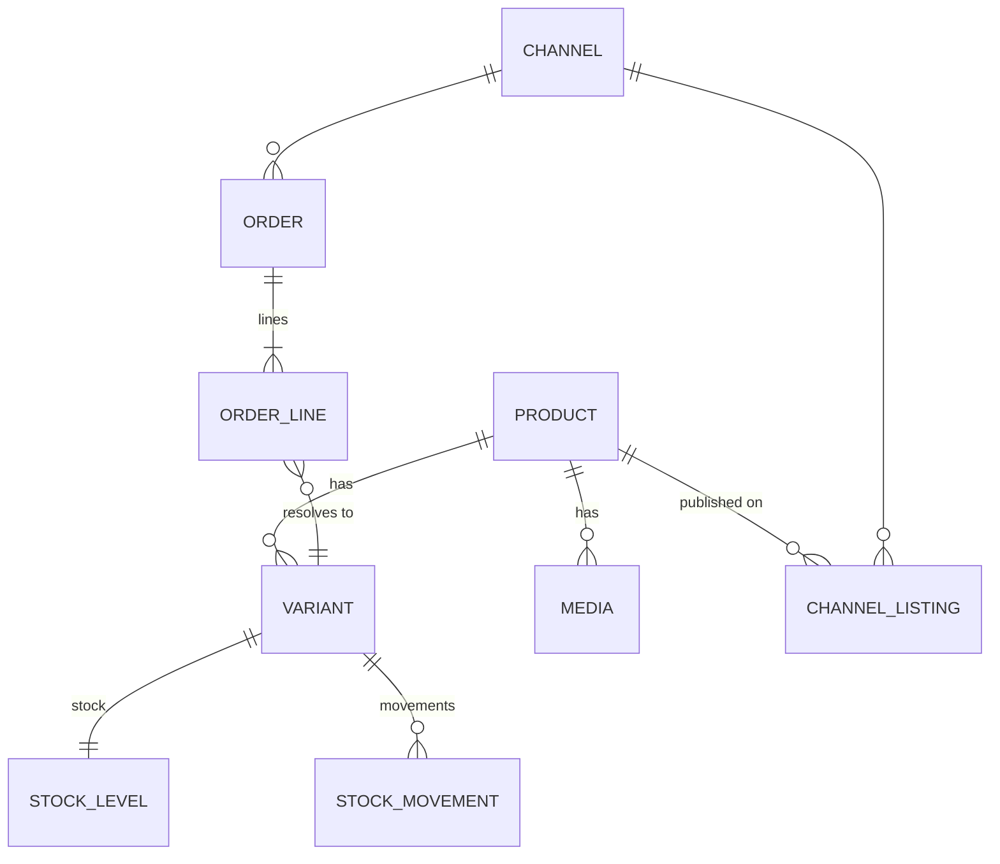

# 03 — Canonical data model

## 1. Principle

The canonical model is **the expressive lowest common multiple** of the supported marketplaces, plus
an `attributes` bag for everything channel-specific. We never model "eBay's field X": we model the
concept, and the driver maps it.



## 2. Product / Variant

The sellable unit is the **Variant**, identified by the canonical `sku`. A `Product` without variants
has a single implicit variant sharing the same SKU.

```jsonc
{
  "sku": "TSHIRT-BASE",            // parent product SKU
  "tenantId": "acme",
  "revision": 42,                   // monotonic, bumped on every real change
  "status": "ACTIVE",               // ACTIVE | DRAFT | DISCONTINUED
  "type": "VARIANT_PARENT",         // SIMPLE | VARIANT_PARENT
  "title": { "it": "T-shirt basic", "en": "Basic tee" },
  "description": { "en": "<p>…</p>" },
  "brand": "Acme",
  "categoryPath": ["Clothing", "Men", "T-shirts"],
  "identifiers": { "mpn": "TS-100" },
  "media": [
    { "role": "MAIN", "url": "https://cdn/…/1.jpg", "position": 1, "hash": "sha256:…" }
  ],
  "attributes": { "material": "cotton", "fit": "regular" },
  "variantAxes": ["size", "color"],
  "variants": [
    {
      "sku": "TSHIRT-BASE-M-RED",
      "identifiers": { "ean": "8001234567890" },
      "axisValues": { "size": "M", "color": "Red" },
      "price": { "amount": "19.90", "currency": "EUR" },
      "compareAtPrice": { "amount": "24.90", "currency": "EUR" },
      "weightGrams": 180,
      "dimensionsMm": { "l": 300, "w": 200, "h": 20 },
      "media": [],
      "attributes": {}
    }
  ],
  "channelOverrides": {             // targeted per-channel deviations
    "ebay-it-main": { "price": { "amount": "21.90", "currency": "EUR" } }
  },
  "source": { "feedId": "…", "sourceId": "supplier-x", "importedAt": "…" }
}
```

**Modelling notes**
- Texts are **localized** (`Map<locale, String>`) from the start: removing that later is cheap,
  adding it later is not.
- `channelOverrides` avoids duplicating the product per channel.
- `media[].hash` lets us skip re-uploading identical images (image APIs are the slowest).
- `revision` lives on the parent product: this simplifies ordering and diffing, at the cost of a few
  extra publishes.

## 3. ChannelListing — the heart of the upsert

One row per `(sku, channelId)`. This is where the memory of "what I already sent" lives.

```sql
CREATE TABLE channel_listing (
  id                 UUID PRIMARY KEY,
  tenant_id          TEXT NOT NULL,
  sku                TEXT NOT NULL,
  channel_id         TEXT NOT NULL,
  external_id        TEXT,                 -- e.g. eBay listingId / offerId, Woo product id
  external_variant_ids JSONB,              -- canonical sku -> external variant id
  state              TEXT NOT NULL,        -- NOT_LISTED|PENDING|LISTED|ERROR|ENDED|BLOCKED
  published_revision BIGINT,               -- canonical revision of the last successful publish
  published_snapshot JSONB,                -- canonical payload actually published
  snapshot_hash      TEXT,                 -- hash of the snapshot, for fast comparison
  field_hashes       JSONB,                -- per-group hashes: {"price":"…","stock":"…","content":"…","media":"…"}
  last_command_id    UUID,
  last_error_code    TEXT,
  last_error_message TEXT,
  last_attempt_at    TIMESTAMPTZ,
  last_success_at    TIMESTAMPTZ,
  retry_count        INT NOT NULL DEFAULT 0,
  next_retry_at      TIMESTAMPTZ,
  UNIQUE (tenant_id, sku, channel_id)
);
CREATE INDEX ON channel_listing (state, next_retry_at);
CREATE INDEX ON channel_listing (channel_id, state);
```

Hashing per **group** rather than per individual field is the right trade-off: it lets us say "only
the stock changed" and therefore call the lightweight inventory API instead of a full listing update.

## 4. Stock

```sql
CREATE TABLE stock_level (
  sku        TEXT PRIMARY KEY,
  on_hand    INT  NOT NULL DEFAULT 0,
  reserved   INT  NOT NULL DEFAULT 0,
  buffer     INT  NOT NULL DEFAULT 0,   -- safety stock, never published
  available  INT  GENERATED ALWAYS AS (GREATEST(0, on_hand - reserved - buffer)) STORED,
  version    BIGINT NOT NULL DEFAULT 0, -- optimistic locking
  updated_at TIMESTAMPTZ NOT NULL
);

CREATE TABLE stock_movement (
  id              BIGSERIAL PRIMARY KEY,
  sku             TEXT NOT NULL,
  delta           INT  NOT NULL,          -- negative for a sale
  absolute_value  INT,                    -- only set for feed-driven SETs
  reason          TEXT NOT NULL,          -- FEED_SET|ORDER|CANCEL|RETURN|MANUAL|RECONCILE
  channel_id      TEXT,
  reference       TEXT,                   -- orderId, feedId…
  idempotency_key TEXT NOT NULL UNIQUE,
  created_at      TIMESTAMPTZ NOT NULL
);
```

The ledger is **append-only**: it supports auditing ("why is the stock 3?") and rebuilding the
projection if it ever gets corrupted.

## 5. Order

```jsonc
{
  "orderId": "01J…",                 // canonical ULID
  "channelId": "ebay-it-main",
  "channelOrderId": "12-34567-89012",
  "status": "PAID",
  "placedAt": "2026-09-01T10:22:31Z",
  "currency": "EUR",
  "totals": { "items": "39.80", "shipping": "4.90", "tax": "0.00", "grand": "44.70" },
  "buyer": { "channelUserId": "buyer123", "email": "…", "name": "…" },
  "shippingAddress": { "…": "…" },
  "lines": [
    {
      "lineId": "1",
      "channelSku": "TSHIRT-BASE-M-RED",
      "sku": "TSHIRT-BASE-M-RED",     // null when UNMAPPED
      "resolution": "MAPPED",          // MAPPED | UNMAPPED | AMBIGUOUS
      "quantity": 2,
      "unitPrice": "19.90",
      "channelLineId": "…"
    }
  ],
  "stockApplied": true,                // idempotency of the decrement
  "raw": { "…": "original payload, retained" }
}
```

Constraint: `UNIQUE(channel_id, channel_order_id)`. The `raw` payload is retained (or linked in
object storage) for debugging mappings.

## 6. Channel and configuration

```jsonc
{
  "channelId": "ebay-it-main",
  "type": "EBAY",
  "marketplace": "EBAY_IT",
  "enabled": true,
  "credentialsRef": "vault://piovra/ebay/acme-it",
  "policy": {
    "stockBuffer": 2,
    "maxPublishableQty": 99,
    "priceAdjustment": { "type": "PERCENT", "value": 8.0 },
    "publishStrategy": "AUTO",         // AUTO | MANUAL_APPROVAL
    "fullFeedDelistsMissing": true
  },
  "rateLimit": { "requestsPerSecond": 8, "burst": 20, "dailyQuota": 100000 },
  "polling": { "orders": "PT2M", "reconcile": "PT6H" },
  "categoryMapping": { "Clothing/Men/T-shirts": "15687" },
  "listingRules": [
    { "when": "media.length < 1", "action": "BLOCK", "reason": "missing image" },
    { "when": "price.amount < 1.00", "action": "BLOCK", "reason": "invalid price" }
  ]
}
```

## 7. Synchronization tracking

```sql
CREATE TABLE sync_attempt (
  id             BIGSERIAL PRIMARY KEY,
  command_id     UUID NOT NULL,
  sku            TEXT NOT NULL,
  channel_id     TEXT NOT NULL,
  operation      TEXT NOT NULL,   -- UPSERT|INVENTORY|PRICE|END|ORDER_FETCH
  attempt        INT  NOT NULL,
  outcome        TEXT NOT NULL,   -- SUCCESS|RETRYABLE_ERROR|PERMANENT_ERROR|SKIPPED_NOOP|STALE
  error_code     TEXT,
  error_message  TEXT,
  http_status    INT,
  request_digest TEXT,            -- hash of the payload, not the payload (PII, size)
  latency_ms     INT,
  trace_id       TEXT,
  created_at     TIMESTAMPTZ NOT NULL
) PARTITION BY RANGE (created_at);
```

Partitioned monthly, retained for 90 days. This table feeds the error console and the
synchronization-quality metrics.
