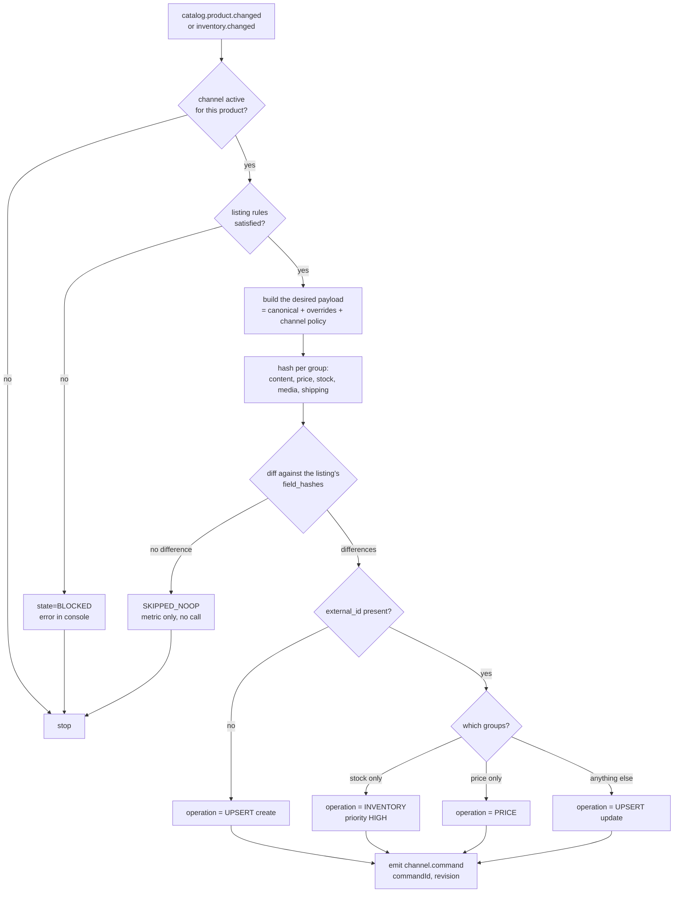

# 06 — Publish / upsert flow

## 1. Upsert semantics

> *"If the product does not exist on the marketplace, create it. If it exists, update only what
> changed. If nothing changed, do not call the API at all."*

The third clause is what determines the system's real performance: marketplaces have tight rate
limits, and most feeds resend 95 % identical data.

## 2. The publication decision



## 3. The desired payload

```
desired = canonical
        ⊕ channelOverrides[channelId]        // explicit deviations
        ⊕ channel policy                      // priceAdjustment, stockBuffer, maxQty
        ⊕ category/attribute mapping          // the channel's taxonomy
```
The computation is **pure and deterministic**: same input, same payload, same hash. That property is
what makes the diff trustworthy and the tests easy (golden files).

## 4. Diffing by field group

| Group | Fields | Typical API |
|---|---|---|
| `stock` | available quantity | dedicated inventory endpoint, lightweight, high frequency |
| `price` | price, compare-at price | offer/price endpoint |
| `content` | title, description, attributes, category | full listing update, heavy |
| `media` | images (by hash) | image upload, very heavy |
| `shipping` | weight, dimensions, policy | listing update |

Each group has its own hash in `channel_listing.field_hashes`. The driver receives `changedGroups`
and picks the cheapest available call.

## 5. Idempotency and concurrency

| Problem | Solution |
|---|---|
| Command delivered twice | the driver persists `commandId` in a `processed_command` table (7-day TTL); a duplicate re-emits the previous outcome |
| Out-of-order commands | the command carries `revision`; the driver discards it when `revision < channel_listing.published_revision`, reporting `STALE` |
| Two concurrent commands for the same SKU | impossible by construction: same Kafka key → same partition → same consumer, in order |
| Duplicate listing creation | a marketplace-side idempotency key where supported (eBay's `SKU` is a natural key, Woo requires a lookup by `sku`); otherwise *lookup-before-create* with a cache |
| Lost listing update | `channel_listing` is updated with `WHERE published_revision < :revision` (optimistic) |

## 6. Batching and rate limits

- The driver accumulates commands over a **window** (e.g. 200 ms or 50 commands, whichever comes
  first) and uses bulk APIs where they exist (eBay `bulkUpdatePriceQuantity` up to 25 offers, Woo
  `POST /products/batch` up to 100).
- A **distributed rate limiter** (a Redis token bucket) per `channelId`, so the limit applies
  cluster-wide rather than per instance.
- When the bucket is empty the consumer calls `KafkaConsumer.pause()` on its partitions and resumes
  when tokens are available. No heap buildup, no wasted retries, and lag becomes the saturation
  metric.
- **Priority**: stock updates (oversell risk) take precedence over content. Implemented with separate
  topics (`command.high.v1` / `command.normal.v1`) consumed with different quotas — priority *within*
  a Kafka partition does not exist and has to be modelled with topics.

## 7. Handling the outcome

```
SUCCESS          → update external_id, published_revision, snapshot, field_hashes, state=LISTED, retry_count=0
NOOP             → metric only, no state change
STALE            → ignored (an updated command is on its way)
RETRYABLE_ERROR  → retry_count++, next_retry_at, send to the retry topic with backoff
PERMANENT_ERROR  → state=ERROR, last_error_*, row in sync_errors, no automatic retry
```

## 8. Reconciliation

The diff trusts `published_snapshot`. If someone edits the listing **directly on the marketplace**,
Piovra will not notice. Countermeasure: a per-channel reconciliation job (every 6 h by default, and
on demand):

1. Fetch the real listing state (listing/inventory APIs, paginated).
2. Compare against `published_snapshot`.
3. Divergences emit `reconciliation.drift` with details plus a configurable policy:
   - `PIOVRA_WINS` (default): republish the canonical value;
   - `REPORT_ONLY`: report and do nothing;
   - `MARKETPLACE_WINS` for specific fields (e.g. stock on a channel that also sells in store).

Reconciliation also repairs `channel_listing` rows missing an `external_id` because an outcome was
lost.

## 9. Delisting

A product leaves a channel when: `status=DISCONTINUED`, it falls outside the listing rules, the
channel is disabled, or `available=0` **and** the channel policy is `END_ON_ZERO`. On eBay it is
better to set the quantity to zero than to end the listing (this preserves history and ranking); on
WooCommerce we set `stock_status=outofstock` or `status=private`. The behaviour is per channel, not
core business logic.

## 10. Resync and bulk publish

- **Single resync**: `POST /v1/products/{sku}/resync?force=true` clears `field_hashes`, so the next
  diff produces a full update.
- **Channel resync**: enumerates listings in `ERROR`/`NOT_LISTED` and queues them on `command.low.v1`
  with throttling, so the daily quota is not consumed in five minutes.

## 11. Flow metrics

`publish.commands.emitted`, `publish.noop.ratio` (target > 0.8 at steady state),
`publish.latency.p95` per field group, `listing.state` per channel,
`channel.ratelimit.saturation`, `publish.stale.dropped`.
