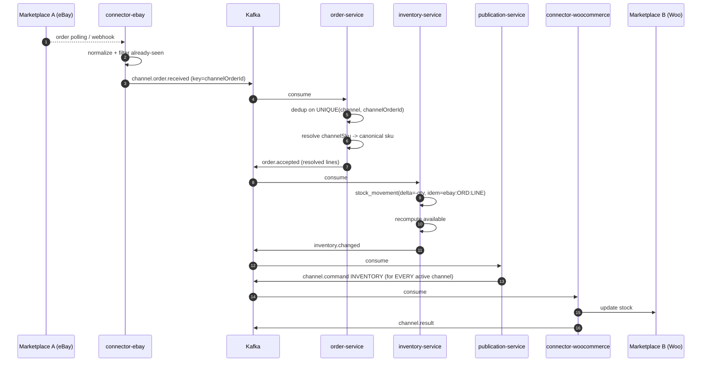

# 07 — Order and inventory flow

## 1. The closed loop



**Target loop latency**: order observed → stock updated on the other channels in under 15 s
(dominated by the origin marketplace's polling interval).

## 2. Order acquisition

### 2.1 Polling (default)
Each driver runs a scheduler per account. Polling uses a **sliding window with overlap**:

```
from = lastSuccessfulPollAt - overlap(5 min)
to   = now
```
The overlap absorbs visibility delays and clock skew across marketplaces; downstream deduplication
makes duplicates harmless. The cursor (`lastSuccessfulPollAt`, or the channel's pagination token) is
persisted and advances **only after** the page has been successfully published to Kafka.

Adaptive interval: 1–2 minutes at peak, 5–10 minutes overnight. If polling has not run for more than
N intervals, an alert fires — this is a dangerous silent failure: no errors, orders simply stop
arriving.

### 2.2 Webhooks (where available)
WooCommerce exposes `order.created`/`order.updated` webhooks. We use them as an **accelerator**,
never as the only source: a webhook is a *hint* that triggers an immediate order fetch over the API.
Rules: verify the HMAC signature, answer `200` immediately (processing is asynchronous), stay
idempotent on the event id. Polling stays on as a safety net.

### 2.3 Modified and cancelled orders
Status updates are polled too (cancellations, refunds, shipments). Every transition produces
`order.status.changed`; cancellations and returns generate **positive** stock movements with their
own idempotency key (`ebay:ORD:LINE:CANCEL`).

## 3. Deduplication and SKU resolution

| Case | Behaviour |
|---|---|
| Order already present | only the status is updated; **no** new stock movement |
| `channelSku` mapped | line is `MAPPED`, normal decrement |
| Unknown `channelSku` | line is `UNMAPPED`: the order is stored, an alert fires, no decrement; once the mapping exists, the console can **apply the movement** retroactively |
| Ambiguous SKU (several canonical products) | `AMBIGUOUS`, manual resolution |
| Sold but not managed by Piovra | `EXTERNAL`, ignored by inventory |

Resolution uses, in order: `external_variant_ids` from the `channel_listing`, then the SKU as a
natural key, then the EAN/GTIN.

## 4. Decrement and anti-oversell

### 4.1 Idempotency
`stock_movement.idempotency_key = "{channelId}:{channelOrderId}:{lineId}"` with a `UNIQUE`
constraint. An `INSERT ... ON CONFLICT DO NOTHING` that inserts nothing means "already applied": we
carry on without an error. This is what makes at-least-once consumption safe.

### 4.2 The transaction
```sql
BEGIN;
  INSERT INTO stock_movement (...) VALUES (...) ON CONFLICT (idempotency_key) DO NOTHING;
  -- only when a row was inserted:
  UPDATE stock_level
     SET on_hand = on_hand - :qty, version = version + 1, updated_at = now()
   WHERE sku = :sku;
  INSERT INTO outbox (...) VALUES (the inventory.changed event);
COMMIT;
```
A single local transaction: no saga, no 2PC. Propagation to the channels is eventually consistent,
and that is acceptable — what is not acceptable is losing a movement.

### 4.3 Preventing overselling
Overselling is **structurally impossible to eliminate** with marketplaces that offer no reservations:
between the sale on A and the update on B there is always a window. It is mitigated on four fronts:

1. **Per-channel stock buffer** — we publish `available - buffer`. On fast channels (eBay) the buffer
   is larger. This is the primary defence.
2. **Priority for stock updates** — a high-priority topic, small batches, reserved rate-limit budget.
3. **Critical threshold** — when `available` drops below a threshold (say 3), propagation becomes
   immediate without batching and, optionally, the product is "frozen" on the other channels
   (quantity 0) until the stock level is confirmed.
4. **Reconciliation** — a periodic job comparing published stock against canonical stock, correcting
   drift.

If overselling happens anyway, the order is still ingested and stock may go **negative** (`on_hand`
is allowed to be negative, while `available` remains `max(0, …)`). An `inventory.oversold` event is
emitted with an alert: the system reports the problem, it does not hide it.

### 4.4 Race: feed SET versus orders
A feed setting `on_hand = 10` while two orders have just decremented by 3 risks pushing stock back to
10 and ignoring the sales. Rules:
- A feed `SET` carries the feed's `sourceTimestamp`. It is applied as an absolute movement only when
  `sourceTimestamp > last_feed_set_at`.
- `ORDER` movements that happened **after** the feed's `sourceTimestamp` are re-applied on top of the
  absolute value (the ledger allows recomputing it exactly).
- Alternatively, for suppliers whose stock feed is reliable: an `AUTHORITATIVE_SET` mode that accepts
  the value as-is. Configurable per source.

## 5. Order statuses

```
NEW → PAID → SHIPPED → COMPLETED
  ↘ CANCELLED (restock)
       PAID → REFUNDED (full or partial restock)
```
The canonical statuses are few and mapped by the drivers; the marketplace's native statuses stay in
`raw` and in `channelStatus`.

## 6. Tracking updates (optional, phase 2)

If a WMS or ERP provides the shipment, the flow is symmetric: `order.fulfillment.requested` →
`channel.command.FULFILL` → driver → marketplace API → `channel.result`. Modelled in the topic design
now, not implemented in phase 1.

## 7. Metrics

`orders.ingested` per channel, `orders.duplicate.ratio`, `orders.unmapped.count` (must trend to
zero), `inventory.propagation.latency.p95`, `inventory.oversold.count`, `poll.lag.seconds` per
account (alert above 3× the interval).
