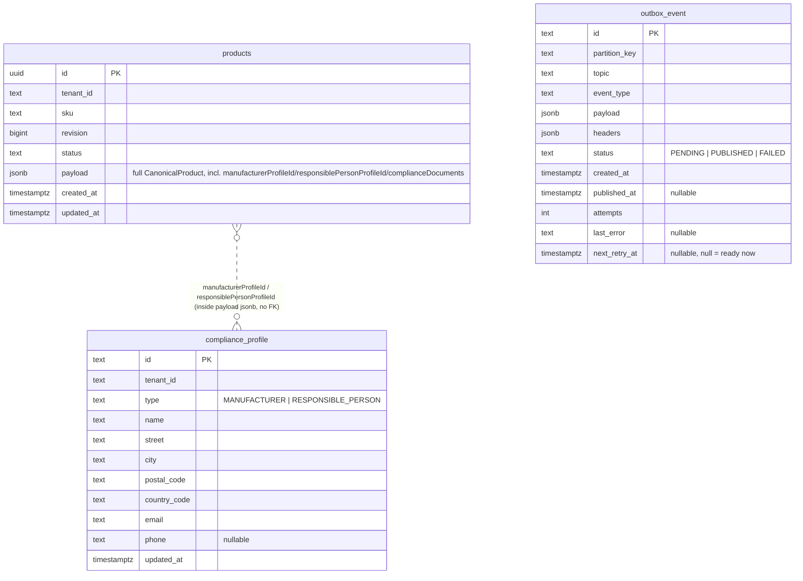
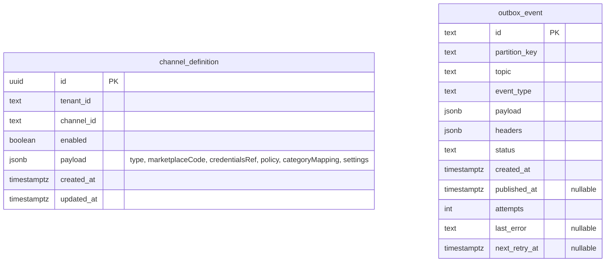
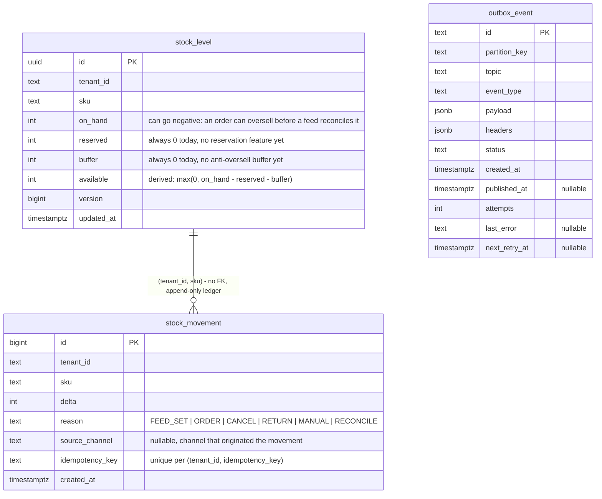
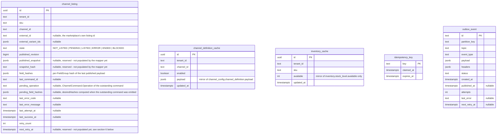

# 13 — Database schema

One Postgres schema per service (docs/12-development-guidelines.md section 5.5): each module's
migrations touch only its own schema, enforced at the grant level. There are **no cross-schema
foreign keys** - a service never queries another service's tables directly
(`ArchitectureTest.services_do_not_call_each_other`). Where two schemas reference the same logical
entity (a `sku`, a `channel_id`), the link is by convention only, kept in sync by consuming Kafka
events, not by a database constraint. Those logical links are marked "no FK" below.

**Keep this file in sync with the migrations.** Whenever a `db/migration/<schema>/V*.sql` file is
added or changed, update the matching diagram and the notes in the same commit.

## 1. `catalog` schema

- `products`: point lookup by `(tenant_id, sku)`, unique. JSONB payload, not normalized - see the
  migration's own comment and `docs/12` section 1 ("keep it simple until a relational query is
  actually needed").
- `compliance_profile`: flat columns (looked up by `(tenant_id, type)`, not a point lookup), reused
  across many products by id. A product's reference lives inside its JSONB `payload`
  (`manufacturerProfileId`/`responsiblePersonProfileId`), so the relationship above is **not** an
  enforced FK - `ProductUpsertService` validates it in application code at write time.
  `complianceDocuments` (a list, also inside `payload`) has no separate table.
- `outbox_event`: identical shape in every schema - see section 5.

## 2. `channel_config` schema

- `channel_definition`: point lookup by `(tenant_id, channel_id)`, unique. `credentialsRef` inside
  `payload` is a Vault path, never a secret itself (docs/12 section 2.4).

## 3. `inventory` schema

- `stock_level`: the current projection, one row per `(tenant_id, sku)`.
- `stock_movement`: append-only ledger, never updated or deleted. `idempotency_key` is what makes
  "receiving the same event twice" (docs/12 section 6) a no-op -
  `Ids.stockMovementKey(...)` for order-driven deltas, `Ids.stockSetKey(...)` for REST/feed SETs.
- Every change to `stock_level.available` that actually moves the value emits `InventoryChanged`
  through `outbox_event` (see `ApplyStockMovementsService`).

## 4. `publication` schema

- `channel_listing`: the diff's memory - see `docs/03-data-model.md` section 3 and
  `ChannelListing` (domain). One row per `(tenant_id, sku, channel_id)`, unique.
  `pending_operation`/`pending_field_hashes` carry the target operation and hashes from
  command-emission (`PENDING`) time forward to result-consumption time, since `ChannelResult`
  carries neither - `ChannelResultHandler` (consuming `Topics.CHANNEL_RESULT`) is what closes the
  loop: `SUCCESS` promotes `pending_field_hashes` into `field_hashes` and sets `LISTED` (or `ENDED`
  if `pending_operation=END`), `PERMANENT_ERROR`/`RETRYABLE_ERROR` set `ERROR` and increment
  `retry_count`, `NOOP`/`STALE` are no-ops.
- `channel_definition_cache` / `inventory_cache`: **local read-models**, not owned data - fed by
  consuming `channel.config.v1` / `inventory.changed.v1`, never written directly (see section 6).
  This is the pattern for "another service's data, without calling it synchronously"
  (`ArchitectureTest.services_do_not_call_each_other`).
- `idempotency_key`: backs `@Idempotent` on `ProductChangedHandler.handle(...)` - a generic claim
  table, not specific to any one event type.

## 5. The outbox table (repeated per schema, not shared)

Every schema that writes to Kafka has its own `outbox_event` table (`catalog`, `channel_config`,
`inventory`, `publication` - `orders` will get one too once `piovra-order` exists). Deliberately
**not** a single shared table: each module's outbox lives in its own schema so "a module touches
only its own schema" holds at the Postgres grant level, not just by convention
(`OutboxEntity`'s own javadoc, `docs/12` section 5.5). All four are structurally identical; see
`libs/piovra-outbox/src/main/java/dev/piovra/outbox/OutboxEntity.java` for the shared shape and
`OutboxRelay`/`BackoffCalculator` for how `next_retry_at` and `FAILED` are used.

## 6. Cross-schema logical relationships (no FK, kept in sync via Kafka)

| From | To | Kept in sync by |
|---|---|---|
| `publication.channel_definition_cache` | `channel_config.channel_definition` | `ChannelConfigConsumer` consuming `channel.config.v1` |
| `publication.inventory_cache` | `inventory.stock_level.available` | `InventoryChangedConsumer` consuming `inventory.changed.v1` |
| `publication.channel_listing` | `catalog.products` (via `tenant_id, sku`) | `ProductChangedConsumer` consuming `catalog.product.changed` |
| `inventory.stock_level` | `catalog.products` (via `tenant_id, sku`) | `ProductChangedConsumer` (inventory's own) - ensures a zeroed row exists per known SKU |
| `catalog.products.payload.manufacturerProfileId` / `.responsiblePersonProfileId` | `catalog.compliance_profile.id` | validated in-process at write time (`ProductUpsertService`), same schema so a real FK would be possible but the product itself is JSONB |
| `inventory.stock_movement` (`reason=ORDER`/`RETURN`) | `orders.*` (not built yet) | future: `piovra-order` publishing `order.accepted`, consumed by `OrderAcceptedHandler` |

## 7. Known gaps as of this writing

- `channel_listing.published_snapshot` and `.snapshot_hash` exist in the table (per the original
  `docs/03-data-model.md` design) but are **not yet populated** - no reconciliation job exists yet
  (docs/06-publish-flow.md section 8) to compare against a marketplace-side edit.
- `channel_listing.next_retry_at` is likewise unpopulated: `RETRYABLE_ERROR` is currently handled
  the same as `PERMANENT_ERROR` by `ChannelResultHandler` (mark `ERROR`, increment `retry_count`),
  not routed through a separate retry-topic-with-backoff redelivery mechanism
  (docs/09-errors-observability.md section 2) - that is consumer-side redelivery machinery, a
  materially larger feature, deliberately deferred.
- No `sync_errors` history table exists - `channel_listing.last_error_code`/`last_error_message`
  only keep the *most recent* error, not a history, per docs/06-publish-flow.md section 7's mention
  of "a row in sync_errors" for `PERMANENT_ERROR`.
- No admin/requeue tooling for a listing stuck in `ERROR` - same deliberate scope cut as the
  outbox's own `FAILED` state (section 5): inspectable via SQL or `GET /v1/listings/{sku}` for now.
- `services/piovra-order` does not exist yet, so `reserved`/`buffer` on `inventory.stock_level`
  and the `orders` Flyway schema (already listed in `apps/piovra-core`'s `application.yml`) are
  provisioned but unused.

## 8. Reading publication status externally

`GET /v1/listings/{sku}` (every channel) and `GET /v1/listings/{sku}/{channelId}` (one channel), on
`piovra-publication`, return `ChannelListing` as-is - the intended way for another app or a CRM to
read publication status and errors without any Kafka integration on their side. Same
`X-Piovra-Tenant` header convention as every other REST endpoint in this repo.
